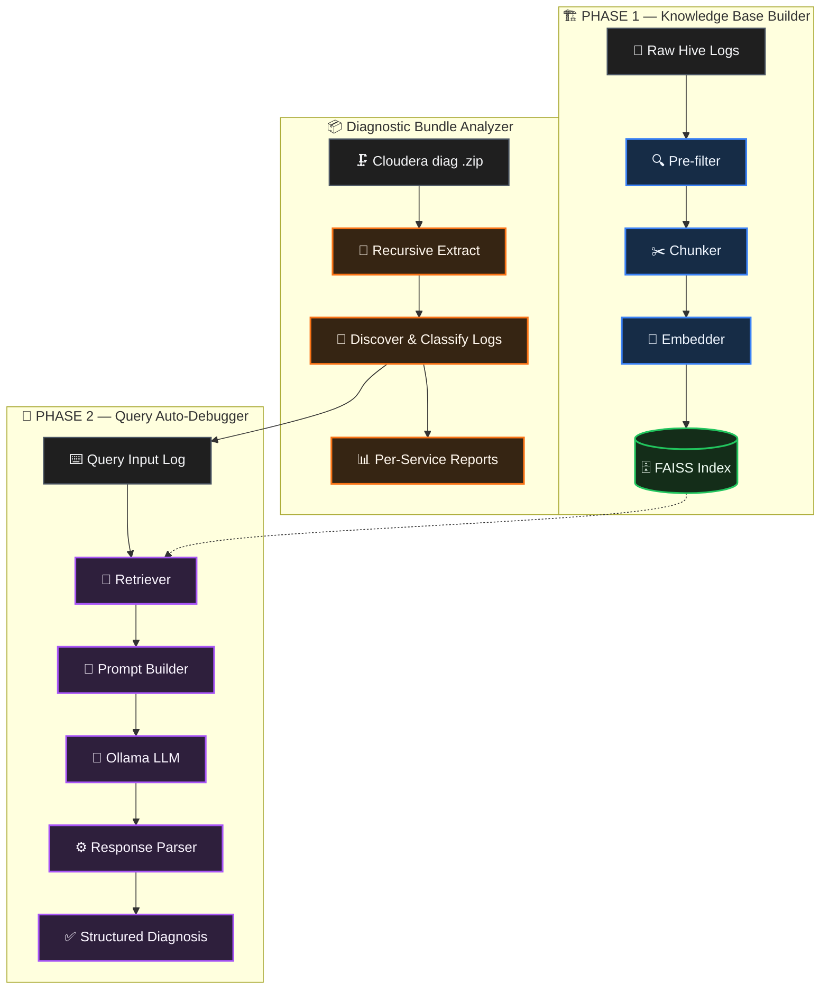

# HIVESight

### AI-Powered Hive Log Analyzer & Query Auto-Debugger

HIVESight is a **local, privacy-first RAG (Retrieval-Augmented Generation) system** that reads Apache Hive and Cloudera diagnostic logs, finds *why* a query or service failed, and explains it in plain English with supporting log evidence.

It turns hours of manual log grepping into a single command.

```text
Hive / Cloudera logs  ->  pre-filter  ->  chunk  ->  embed  ->  FAISS  ->  retrieve  ->  Ollama LLM  ->  diagnosis
```

HIVESight answers four questions for every failure:

- **What** failed?
- **Where** did it fail in the Hive pipeline (compilation, HMS lookup, optimization, DAG submission, execution, concurrency)?
- **Why** did it fail (root cause + error class)?
- **Which log evidence** supports the diagnosis?

> HIVESight is **diagnosis-only**. It explains failures and cites evidence; it never auto-applies fixes to your cluster.

---

## Table of Contents

- [Key Features](#key-features)
- [Architecture](#architecture)
- [Services / Modules](#services--modules)
- [Supported Failure Stages](#supported-failure-stages)
- [Requirements](#requirements)
- [Installation](#installation)
- [Quick Start](#quick-start)
- [Building the Knowledge Base (Phase 1)](#building-the-knowledge-base-phase-1)
- [Query Auto-Debugger (Phase 2)](#query-auto-debugger-phase-2)
- [Diagnostic Bundle Analyzer](#diagnostic-bundle-analyzer)
- [Output Types](#output-types)
- [Project Structure](#project-structure)
- [Configuration](#configuration)
- [Important Notes](#important-notes)

---

## Key Features

- **Local & private** — runs entirely on your machine with a local Ollama LLM (`llama3.2`). No logs leave your environment.
- **Smart pre-filtering** — discards ~90% of `INFO` noise and keeps `WARN`/`ERROR`/`FATAL` lines with stack-trace context.
- **Semantic retrieval** — embeds historical failures into a FAISS vector index for similarity search.
- **Category-aware reranking** — biases retrieval toward the most likely failure category (HMS, CBO, Tez AM, etc.).
- **Multiple entry points** — debug by query ID, pasted exception, uploaded log file, or an entire Cloudera diagnostic bundle.
- **Whole-bundle analysis** — auto-extracts nested `.zip`/`.gz` bundles and triages HS2, HMS, YARN, HDFS, HBase, Tez, ZooKeeper, Kafka, Atlas, Ranger, and more.
- **Plain-English summaries** — full-log summaries with status, failure stages, counts, top errors, and key query IDs.
- **Saveable reports** — every diagnosis and summary can be written to `.txt` report files.

---

## Architecture

HIVESight is organized into two phases plus a bundle orchestrator.




Text view of the core pipeline:

```text
            ┌──────────────────── PHASE 1 (offline build) ────────────────────┐
 Hive logs ─►  prefilter ─►  chunker ─►  embedder ─►  FAISS index + metadata.json
            └──────────────────────────────────────────────────────────────────┘
                                              │
            ┌──────────────────── PHASE 2 (on demand) ────────┐
 user input ─►  retriever ─►  prompt ─►  Ollama LLM ─►  parser ─►  diagnosis + evidence
            └──────────────────────────────────────────────────┘
```

---

## Services / Modules

| Module | File | Responsibility |
| --- | --- | --- |
| **Pre-filter** | `phase1/prefilter.py` | Extracts `WARN`/`ERROR`/`FATAL` anchor lines with context windows; drops noise. |
| **Chunker** | `phase1/chunker.py` | Splits entries into overlapping 300–500 token chunks tagged with metadata. |
| **Embedder** | `phase1/embedder.py` | Encodes chunks with `sentence-transformers/all-MiniLM-L6-v2` (384-dim). |
| **Indexer** | `phase1/indexer.py` | Builds and persists the FAISS `IndexFlatL2` index + `metadata.json`. |
| **Pipeline** | `phase1/pipeline.py` | Orchestrates Phase 1: prefilter → chunk → embed → index. |
| **Retriever** | `phase2/retriever.py` | Loads FAISS, embeds the query, performs top-k search with category-aware reranking. |
| **Prompt Builder** | `phase2/prompt.py` | Builds system + diagnosis/exception/summary prompts. |
| **LLM Client** | `phase2/llm.py` | Calls the local Ollama model (swappable provider). |
| **Parser** | `phase2/parser.py` | Parses LLM output into a structured diagnosis (handles imperfect JSON). |
| **Debugger** | `phase2/debugger.py` | Orchestrates the full Phase 2 RAG flow and log-file / summary workflows. |
| **Bundle Analyzer** | `diag_bundle.py` | Extracts and triages full Cloudera diagnostic bundles across all services. |

**Cluster services HIVESight can read logs from:**
`HiveServer2 (HS2)` · `Hive Metastore (HMS)` · `YARN (ResourceManager / NodeManager)` · `HDFS (NameNode / DataNode)` · `HBase (Master / RegionServer)` · `Tez` · `ZooKeeper` · `Kafka` · `Atlas` · `Ranger` · `Solr` · `Knox` · `HttpFS`

---

## Supported Failure Stages

HIVESight classifies failures into the Hive query lifecycle:

| Stage | Examples |
| --- | --- |
| `COMPILATION` | ParseException, invalid column/table alias, syntax errors |
| `HMS_LOOKUP` | Table/Database not found, MetaException, NoSuchObjectException |
| `OPTIMIZATION` | CBO failures, invalid statistics, RelOptPlanner errors |
| `DAG_SUBMISSION` | Tez AM failed to start, SessionNotRunning, SubmitDAG failed |
| `EXECUTION` | OutOfMemoryError, task/vertex failed, Hive runtime errors |
| `CONCURRENCY` | LockException, transaction/txn conflicts |

---

## Requirements

- **macOS / Linux**
- **Python 3.11**
- **[Ollama](https://ollama.com)** running locally with the `llama3.2` model
- ~2 GB free disk for the model + index

Python dependencies (`requirements.txt`):

```text
sentence-transformers==2.7.0
faiss-cpu==1.8.0
transformers==4.40.0
torch==2.2.0
pyyaml==6.0.1
tqdm==4.66.4
numpy==1.26.4
ollama==0.4.4
```

---

## Installation

```bash
# 1. Clone the repository
git clone https://github.com/<your-username>/HIVESight.git
cd HIVESight

# 2. (Recommended) create a virtual environment
python3.11 -m venv .venv
source .venv/bin/activate

# 3. Install Python dependencies
pip install -r requirements.txt

# 4. Install and start Ollama (in a separate terminal)
ollama serve

# 5. Pull the model
ollama pull llama3.2
```

> On macOS with Homebrew Python you can also run the project directly with `/opt/homebrew/bin/python3.11` instead of a virtual environment.

---

## Quick Start

```bash
# Terminal 1 — start the local LLM
ollama serve

# Terminal 2 — build the knowledge base, then debug a log
python run_phase1.py
python debug.py --log-file path/to/hiveserver2.log
```

---

## Building the Knowledge Base (Phase 1)

Run Phase 1 whenever you change the configured logs or noise filters:

```bash
python run_phase1.py
```

This reads the logs listed in `config/config.yaml` and produces:

```text
index/faiss.index
index/metadata.json
```

---

## Query Auto-Debugger (Phase 2)

All commands run from the project root.

**Analyze an uploaded log** (groups failures by `query_id` and diagnoses the top failures):

```bash
python debug.py --log-file hiveserver2.log
```

**Debug one query inside an uploaded log:**

```bash
python debug.py --log-file hiveserver2.log --query-id hive_20260504121608_794bc61e
```

**Debug the latest failed query in an uploaded log:**

```bash
python debug.py --log-file hiveserver2.log --last
```

**Debug a pasted exception:**

```bash
python debug.py --exception "SemanticException: Table not found"
```

**Debug a query from the existing FAISS knowledge base:**

```bash
python debug.py --query-id hive_20260513062702_fcb1696e
```

**Summarize a full log file in plain English:**

```bash
python debug.py --summarize-log hiveserver2.log
```

**Save output to a file:**

```bash
python debug.py --log-file hiveserver2.log --output-file report.txt
```

**Other useful flags:**

| Flag | Effect |
| --- | --- |
| `--no-prompts` | Skip guided follow-up prompts (good for automation) |
| `--verbose` | Print extra progress detail (per-query LLM calls) |
| `--interactive` | Enter an interactive REPL (`last`, `q <id>`, `e <exc>`, `file <path>`, `summary <path>`, `exit`) |

---

## Diagnostic Bundle Analyzer

Analyze an entire Cloudera diagnostic bundle in one shot. It auto-extracts nested zips/gz files, discovers logs, classifies them by service, debugs HS2/HMS, and summarizes other services.

```bash
# Interactive (choose what to do)
python diag_bundle.py --bundle "QUASAR_DIAG_LOGS (2).zip"

# Just list/discover logs
python diag_bundle.py --bundle "QUASAR_DIAG_LOGS (2).zip" --action discover

# Full run: debug HS2/HMS + summarize other services, no prompts
python diag_bundle.py --bundle "QUASAR_DIAG_LOGS (2).zip" --action full --no-prompts
```

Reports are written under `diag_bundle_reports/<timestamp>/`.

---

## Output Types

**Query Diagnosis** includes:
`FAILURE STAGE` · `CONFIDENCE` · `ERROR CLASS` · `ROOT CAUSE` · `KEY EVIDENCE` · `RETRIEVED EVIDENCE`

**Multi-Query Diagnosis** (from `--log-file`) includes:
log file name · failed query count · diagnosed query count · per-query diagnosis blocks.

**Log Summary** (from `--summarize-log`) includes:
overall status · failure stages observed · counts · main events · top errors · important query IDs · evidence chunks.

---

## Project Structure

```text
HIVESight/
├── config/
│   └── config.yaml          # logs, prefilter, chunking, embedding, LLM, retrieval config
├── phase1/                  # Knowledge base builder
│   ├── prefilter.py
│   ├── chunker.py
│   ├── embedder.py
│   ├── indexer.py
│   └── pipeline.py
├── phase2/                  # Query auto-debugger (RAG)
│   ├── retriever.py
│   ├── prompt.py
│   ├── llm.py
│   ├── parser.py
│   └── debugger.py
├── run_phase1.py            # Entry point: build the FAISS index
├── debug.py                 # Entry point: query auto-debugger
├── diag_bundle.py           # Entry point: full Cloudera bundle analyzer
├── requirements.txt
└── README.md
```

> Note: `data/logs/`, `Tests/`, `index/`, raw `*.zip` bundles, and generated reports are **git-ignored** (large and may contain customer data). See `.gitignore`.

---

## Configuration

All behavior is driven by `config/config.yaml`:

- `logs` — which log files feed the Phase 1 knowledge base (path, source, category, failure stage)
- `prefilter` — log levels to keep, context window sizes, and noise patterns to discard
- `chunking` — token sizes and overlap
- `embedding` — model name, vector dimension, batch size
- `index` — FAISS output paths and index type
- `llm` — provider, model, base URL, temperature, max tokens
- `retrieval` — `top_k` and score threshold

The LLM provider is swappable — change the `llm` block to point at a different provider/model.

---

## Important Notes

- `--log-file` analyzes a log at runtime and does **not** permanently add it to FAISS.
- The existing FAISS index is used only as historical context.
- `--query-id` alone searches the existing FAISS KB; `--log-file ... --query-id ...` searches inside the uploaded log.
- Diagnostic logs may contain hostnames, IPs, and customer data — keep them out of version control (already handled by `.gitignore`).
